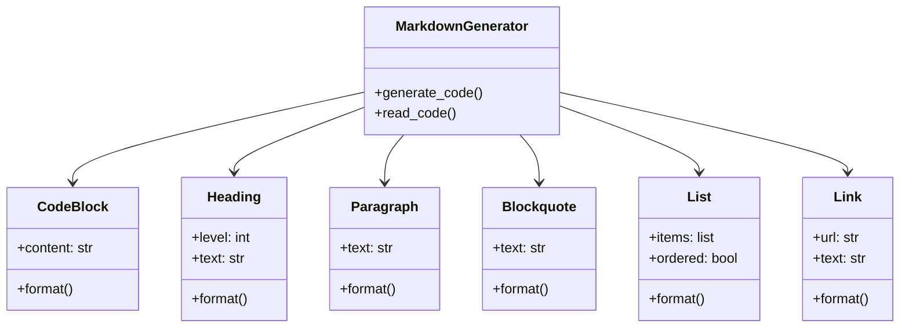

# Architecture Documentation

## Introduction and Goals

Es soll eine Bibliothek erstellt werden mit der well-formed Markdown-Code erzeugt (Schritt 1) und wieder eingelesen (Schritt 2) werden kann.

Zusätzlich soll in dem Beispiel demonstriert werden, wie man arc42  als Architketurdokumentation und die hier definierten Anforderungen dokumentiert werden und anschließend ihre Umsetzung an Hand von Tests bewiesen und dokumentiert werden können.

### Requirements Overview

The requirements are stored in a YAML file. Each requirement is described in its own section and uniquely numbered. The file is saved in the directory [doc/arc42/requirements.yaml](requirements.yaml).

#### Example of a Requirement

```yaml
requirements:
    Req.1234:
        description: The library must be able to generate well-formed Markdown code.
        acceptance_criteria:
            - The generated Markdown code must comply with common standards.
        priority: High
```

#### Testing the Requirements

The requirements are verified through unit tests and integration tests. The tests are implemented using a test framework like `pytest` and stored in the directory `/y:/workspace/_project/_private/Markdown/tests/`. Each requirement is covered by at least one test case.

The example shows how the tests are linked to the corresponding requirement they are testing.

```python
@link_to_requirement("REQ-1234")
def test_function():
    pass

@link_to_requirement("REQ-1234")
^^class TestClass:

    def test_method(self):
        pass
```

### Quality Goals

### Stakeholders

| Role/Name            | Contact | Expectations                                                                   |
| -------------------- | ------- | ------------------------------------------------------------------------------ |
| *Software Developer* | -       | - Bibliothek soll sich einfach integrieren lassen                              |
|                      |         | - Bibliothek soll verschiedene "well formed" Markdown Code erzeugen            |
|                      |         | - Bibliothek soll verschiedene Dialekte behandeln könne                        |
| *Software Architect* | -       | - Bibliothek soll möglichst wenige Abhängikeiten zu anderen Bibliotheken ahben |
|                      |         | - Bibliothek soll gut getestet sein                                            |

## Architecture Constraints

1. Library should be implemented in **Python**
2. der Code soll mindestens  bis Python Version 3.11 kompatibel sein

## Context and Scope

### Business Context

**\<Diagram or Table>**

**\<optionally: Explanation of external domain interfaces>**

### Technical Context

**\<Diagram or Table>**

**\<optionally: Explanation of technical interfaces>**

**\<Mapping Input/Output to Channels>**

## Solution Strategy

## Building Block View

### Whitebox Overall System

***\<Overview Diagram>***

### Class Diagram




Motivation
*\<text explanation>*

Contained Building Blocks
*\<Description of contained building block (black boxes)>*

Important Interfaces
*\<Description of important interfaces>*

### \<Name black box 1>

*\<Purpose/Responsibility>*

*\<Interface(s)>*

*\<(Optional) Quality/Performance Characteristics>*

*\<(Optional) Directory/File Location>*

*\<(Optional) Fulfilled Requirements>*

*\<(optional) Open Issues/Problems/Risks>*

#### \<Name black box 2>

*\<black box template>*

#### \<Name black box n>

*\<black box template>*

#### \<Name interface 1>

…

#### \<Name interface m>

### Level 2

#### White Box *\<building block 1>*

*\<white box template>*

#### White Box *\<building block 2>*

*\<white box template>*

…

#### White Box *\<building block m>*

*\<white box template>*

### Level 3

#### White Box \<\_building block x.1\_\>

*\<white box template>*

#### White Box \<\_building block x.2\_\>

*\<white box template>*

#### White Box \<\_building block y.1\_\>

*\<white box template>*

## Runtime View

### \<Runtime Scenario 1>

-   *\<insert runtime diagram or textual description of the scenario>*

-   *\<insert description of the notable aspects of the interactions
    between the building block instances depicted in this diagram.>*

### \<Runtime Scenario 2>

### …

### \<Runtime Scenario n>

## Deployment View

### Infrastructure Level 1

***\<Overview Diagram>***

Motivation
*\<explanation in text form>*

Quality and/or Performance Features
*\<explanation in text form>*

Mapping of Building Blocks to Infrastructure
*\<description of the mapping>*

### Infrastructure Level 2

#### *\<Infrastructure Element 1>*

*\<diagram + explanation>*

#### *\<Infrastructure Element 2>*

*\<diagram + explanation>*

…

#### *\<Infrastructure Element n>*

*\<diagram + explanation>*

## Cross-cutting Concepts

### *\<Concept 1>*

*\<explanation>*

### *\<Concept 2>*

*\<explanation>*

…

### *\<Concept n>*

*\<explanation>*

## Architecture Decisions

## Quality Requirements

### Quality Tree

### Quality Scenarios

## Risks and Technical Debts

## Glossary

| Term        | Definition        |
| ----------- | ----------------- |
| *\<Term-1>* | *\<definition-1>* |
| *\<Term-2>* | *\<definition-2>* |
